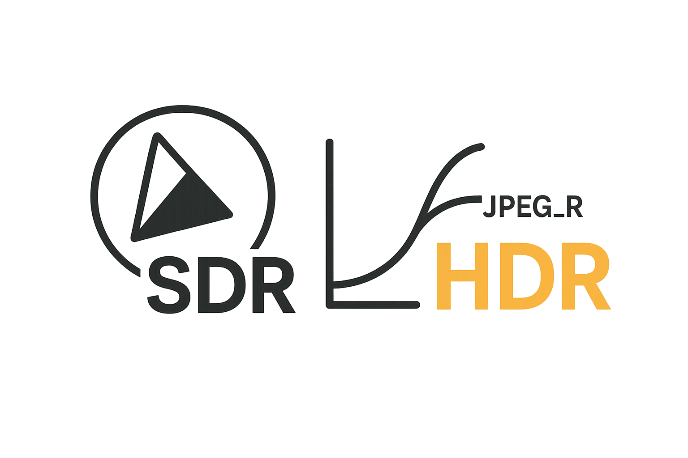

Ultra HDR Gain‑Map Pipeline (MVP)
=================================

  

This repository implements a gain‑map–first pipeline for producing HDR images
that render as HDR on macOS 15+/iOS 18+ (Preview/Photos), Android 14+ (Ultra HDR),
and social apps that support JPEG_R.

Outputs
- Ultra HDR JPEG (JPEG_R) — default; backward‑compatible.
- HEIC with gain map — optional on macOS.
- SDR preview (for web/UI and debugging).
- Optional HDR float TIFF (QA).

Modes
- Reference Mode (preferred): If you have a phone HDR original (HEIC/JPEG_R) or
  an HDR float reference, extract/derive the gain map and re‑embed it with your
  edited SDR base.
- Predictive Mode: If you only have SDR, predict a gain map (e.g., GMNet) and
  package it with the SDR base. A “Boost” control maps to HDRCapacityMax.

Exporters
- Primary: libultrahdr (JPEG_R; cross‑platform).
- Secondary: Apple ImageIO (HEIC; JPEG_R on macOS 15+).

Quick Start
- `make setup`
- `make process IMG=./images/02_edited_sdr.jpeg OUT=./images/02_gainmap.jpg`

Notes
- Place large HDR references under `images/` locally; do not commit them.
- `samples/` contains tiny images suitable for tests.
- The legacy SDR→HDR TF2 code has been archived; the next phase focuses on
  gain‑map–first export. See `docs/PRD_NEXT_PHASE.md`.
